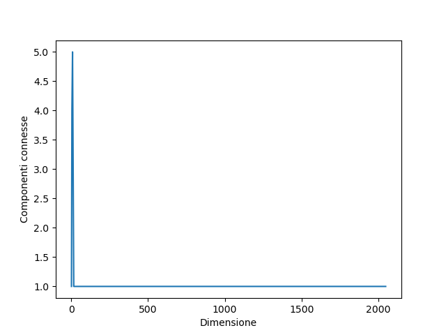
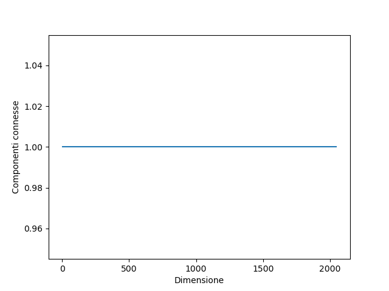
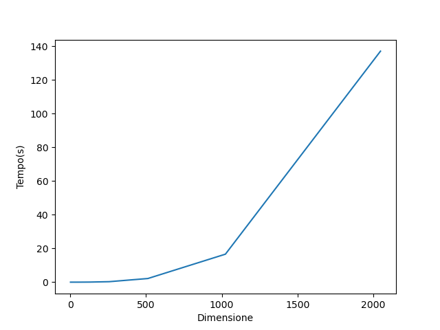
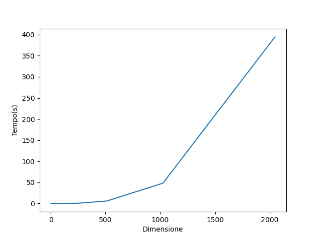
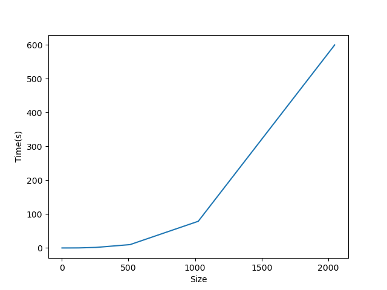
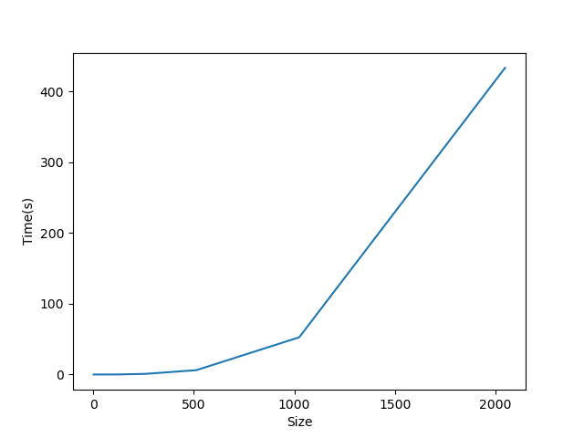

---
author:
- Leonardo Toccafondi   
date: February, 2023 
title: Componenti connesse e Minimium Spanning Tree di un grafo
---

# Introduzione

Il grafo è una struttura che ha numerose applicazioni sia nei campi dell’informatica sia in quelli dell’ottimizzazione.  
Alcuni tipi di operazioni possibili su di essi sono le visite e la ricerca di cammini, o insiemi particolari d cammini  
Gli esperimenti che saranno eseguiti serviranno a esaminare due tipi particolari di ricerche in un grafo: la ricerca delle componenti connesse e la ricerca dell’MST (minimum spanning tree in inglese), quest’ultima sarà effettuata attraverso l’uso dell’algoritmo di Kruskal.  
Ciò che ci interesserà scoprire maggiormente è il comportamento degli algoritmi per queste ricerche all’aumentare dei nodi del grafo e della probabilità di connessione tra gli stessi.  
É necessario infatti che essi siano efficienti su grafi relativamente estesi date le applicazioni reali, un esempio per le componenti connesse è nell’analisi di immagini e quindi OCR, mentre la ricerca di un albero di connessione minimo è un classico problema che si presenta nelle telecomunicazioni.

# Teoria

## Grafi

Un grafo $G$ è un insieme di elementi detti **vertici** (o nodi) che possono essere collegati fra di loro tramite linee chiamate **archi**. In particolare, si dice grafo la coppia ordinata di insiemi $G = (V, E)$, dove $V$ è l’insieme dei vertici di $G$ e $E$ è l’insieme degli archi di $G$.
Un grafo si dice **orientato** (o **diretto**) se $E$ è un insieme di archi *orientati*, cioè con una direzione (da sorgente a destinazione). Viceversa, un grafo si dice **non orientato** (o **indiretto**) se gli archi non sono orientati, dunque se la connessione tra due vertici ij ha lo stesso significato della connessione ji.
Si definisce come grado di un vertice: numero di archi che incidono nel vertice.
Inoltre, ad ogni arco di un grafo può essere assegnato un peso (che di solito corrisponde ad un numero reale, ma può essere anche ristretto agli interi).

I grafi sono utilizzati come strutture dati al fine di rappresentare relazioni tra elementi generici, espresse nel modo più semplice tramite gli archi, che evidenziano le connessioni tra gli elementi.

#### Rappresentazione

Un grafo può essere rappresentato con due tipologie di strutture dati:

- **Lista di adiacenza:** composta da un vettore $Adj$ composto da $|V|$ liste, una per ogni nodo, dove $Adj[u]$ contiene tutti i vertici $v$ t.c. $(u, v) \in E)$.
  
  La lista di adiacenza occupa uno spazio di memoria $\Theta(V + E)$, e un tempo $\Theta(u.degree)$ per determinare se due vertici qualsiasi $(u, v) \in E$.
  In questo caso $u.degree$ rappresenta il **grado** del vertice (u).

- **Matrice di adiacenza:** si introduce una matrice $A$ di dimensione $|V|\times|V|$, dove ogni elemento $(i,j)$ ha valore 1 se $(i, j) \in E)$, cioè se il vertice $j$ è adiacente a $i$, e valore 0 altrimenti. 
  La matrice di adiacenza occupa uno spazio di memoria $\Theta(V^2)$, quindi peggiore rispetto alla lista, però consente di determinare se due vertici qualsiasi $(u, v) \in E$ in un tempo $\Theta(1)$, in quanto è sufficiente accedere all'elemento $A[u][v]$ e controllarne il valore.
  In generale, una matrice di adiacenza è più indicata per descrivere grafi *densi* e con molti archi.

Per gli esperimenti svolti sono state utilizzate ***entrambe*** le strutture dati.

Per estrapolare ulteriori informazioni, si utilizzano le cosiddette componenti connesse e l'albero ricoprente minimo (o Minimum Spanning Tree in inglese), quest'ultimo tramite alcuni algoritmi, tra cui quello di Kruskal. Tuttavia, è necessario prima introdurre una struttura dati per degli insiemi disgiunti, nota anche come *Union-find.*

#### Union find

Gestisce una collezione di insiemi dinamici (disgiunti), ciascuno identificato da un rappresentante,
ovvero un elemento dell'insieme qualsiasi, a patto che rimanga sempre lo stesso.
Su questa struttura dati possiamo operare con tre funzioni:

- MakeSet(x): aggiunge alla collezione un nuovo insieme creato a partire dall’elemento x;

- FindSet(x): restituisce il rappresentante dell’insieme che contiene x;

- Union(x,y): se $x \in S_x, y \in S_y, \ \Rightarrow S \leftarrow S_x -S_y \bigcup \{S_x \cup S_y)$ 
  Quindi aggiunge alla collezione un nuovo insieme contenente gli elementi degli insiemi di x e y, e poi elimina gli insiemi d’origine. Il rappresentante diventa uno degli elementi di $S_x$ o di $S_y$.

Dal punto di vista implementativo, la union-find viene realizzata tramite *liste concatenate*, dove ogni nodo ha come attributi l'elemento dell'insieme, un puntatore al rappresentante ed uno all'elemento successivo. Ogni lista contiene un puntatore alla propria testa ed uno alla propria coda.

Per quanto riguarda invece la complessità temporale, possiamo facilmente costruire una sequenza di m operazioni su n oggetti che richiede un tempo pari a $\Theta(n^2)$. Se il numero di elementi (e quindi il numero di make_set) è pari a $n$ e $m$ è il numero totale di operazioni ($m \geq n$ perché al massimo abbiamo $n$ make_set), allora il costo di $n$ make set è $\Theta(n)$ e considerato che dopo n-1 union abbiamo un solo insieme, allora il costo finale è $\Theta(n^2)$. 
Non solo, anche accodare una lista lunga ad una più corta aumenta il tempo di esecuzione, in quanto sarà necessario aggiornare *ogni* rappresentante della lista che andiamo ad accodare. Per questo si aggiunge un attributo size, al fine di determinare quale delle due liste sia la più corta, e concatenare quest'ultima alla lista più lunga. Con questa ***euristica dell'unione pesata*** una singola Union richiede tempo $\Omega(n)$, perché entrambi gli insiemi hanno $\frac{n}{2}$ elementi. 

> **Teorema**: Il tempo con l'euristica per l'unione pesata per una sequenza di $m$ operazioni su $n$ elementi è pari a $O(m+n\lg n)$

In questo esperimento l'euristica dell'unione pesata è stata implementata aggiungendo l'attributo size alla lista concatenata.

## Componenti connesse

Dato un grafo $G=(V,E)$, una componente connessa é un insieme massimale di vertici $C⊆V$ tale che per ogni coppia di nodi esiste un cammino che li collega.
Le componenti connesse *partizionano* i vertici in classi di equivalenza secondo la relazione *"è raggiungibile da"*. Un grafo è connesso se ogni coppia di vertici è collegata attraverso un cammino.
Sono utilizzate ad esempio per trovare "oggetti" all'interno di immagini, interpretando come nodi i singoli pixel dell'immagine stessa
L'algoritmo utilizzato all'interno di questo esperimento si basa sull'utilizzo di union-find come struttura dati.

## Albero ricoprente minimo (MST)

Si tratti di un albero di connessione T (sottoinsieme dell'insieme di archi $E$ come un grafo non diretto $G=(V,E)$) in cui la somma dei pesi dei suoi archi:

> $w(T) = \sum_{(u,v) \in T} \ w(u, v)$ 

sia minimo e connetta tutti i vertici.
Un MST ha $|V|-1$ archi, non ha cicli e *può non essere unico*.

Esiste un algoritmo generico che permette di costruire la soluzione e consiste in creare un insieme vuoto di archi $A$, per poi aggiungerne progressivamente conservando l'invariante di ciclo:

> ”Se A é un sottoinsieme di qualche MST, l’arco $(u,v)$ é *sicuro* per A se e solo se $A∪(u,v)$ é sottoinsieme di un qualche MST.”

Da questo è possibile ricavare che al fine di ottenere un albero ricoprente minimo sia necessario aggiungere solamente $N-1$ archi *sicuri*, con $N$ pari al numero di nodi.

Per ottenere l'algoritmo di Kruskal, che sarà utilizzato per gli esperimenti, è necessario introdurre il seguente *teorema*:

> "Sia A un sottoinsieme di qualche MST, $(S,V-S)$ un taglio che rispetta $A$ e $(u,v)$ un arco leggero che attraversa $(S,V-S)$. Allora $(u,v)$ é sicuro per $A$."

Anche in questo caso per l'implementazione pratica viene utilizzata la struttura dati *Union-find.*

# Implementazione pratica

Il programma è suddiviso in più file:

- graph.py si occupa della definizione dell'oggetto Node, che al suo interno contiene tutti gli attributi necessari, sia l'oggetto Graph, che corrisponde al nostro grafo.  Il grafo viene popolato assegnando casualmente (in base ad un valore di probabilità) archi ad ogni nodo, portando ad uno il valore corrispondente nella matrice aggiogata.  La matrice può anche essere equivalente alla matrice pesata, nel caso in cui la variabile booleana w sia posta a True al momento della creazione del grafo. Dopodiché viene inserito un vettore composto da [nodo u, nodo v, peso] (il peso nel caso di *default* è posto ad 1). All'interno di questo file è presente anche la funzione sort_edges, utilizzata nell'algoritmo di Kruskal per ordinare in base al peso  gli archi.

- linked_list.py: in questo file vi è implementata la lista collegata utilizzata come base per la struttura dati union-find

- union_find.py: in questo file sono stati implementati gli oggetti e le funzioni necessarie al fine di rappresentare insiemi disgiunti dinamici.

- cc.py: implementazione dell'algoritmo delle componenti connesse

- mst.py: contiene l'implementazione dell'algoritmo di Kruskal

# Esperimenti

In base a delle liste di dimensioni (espresse in percentuale), si vanno a creare grafi di dimensione esponenziale $2^n$, partendo da 0 fino ad arrivare a 12 (quindi 2048 nodi). In un array sono state salvate le probabilità di presenza di un arco tra i nodi (in particolare verranno testate le probabilità 20%, 40%, 60%, 80%, 100%).  
I grafi presi in considerazione saranno grafi pesati generati casualmente.  
La dimensione dei grafi generati sarà sempre crescente ed inoltre saranno testati vari modi di collegare i loro nodi. Per ogni dimensione del grafo saranno generati diversi grafi, uno per ogni probabilità. La crescita del numero di nodi sarà esponenziale, ad ogni ciclo sarà raddoppiata fino ad arrivare ad un massimo di \(2^{11}\).
Per ogni grafo generato prima di tutto verranno ricercate le componenti connesse e sarà registrato il loro numero e il tempo di esecuzione. Dopodichè se è stata trovata esattamente una componente connessa è possibile eseguire la ricerca dell’MST con l’algoritmo di Kruskal. Per questo sarà registrato solo il tempo di esecuzione.
La registrazione dei valori viene effettuata tramite la librerie pickle, mentre i grafici che ne risultano sono stati ottenuti con la libreria matplotlib.

#### Ambiente di test

L'esperimento è stato svolto su un computer con le seguenti caratteristiche:

- Sistema operativo: Linux  Mint 21.1 con kernel 5.15

- CPU: Inter Core i7-9750H

- RAM: 16 GB 

- Interprete Python: conda 22.11.1 e python v

- IDE: Pycharm Community Edition 2022.3.2

# Risultati degli esperimenti

### Componenti connesse

### Minimum spanning tree

# Conclusioni

Esaminando i grafici (inserire tabelle) emerge che molto spesso nel grafo generato si ha una sola componente connessa, soprattutto dal 40% di probabilità in poi.  
Questo è particolarmente vero quando il numero di vertici del grafo è superiore a 10-20, infatti anche se la probabilità di avere un collegamento tra due nodi è abbastanza bassa in qualche modo sarà generato un cammino che collega qualsiasi coppia di nodi, più o meno lungo.  
I tempi di esecuzione di questo algoritmo sono quelli attesi(comenelle figure 4, 5 e 6) ovvero più che lineare rispetto al numero di archi, cioè alla dimensione e alla probabilità di collegamento dei nodi.  

Un comportamento molto simile lo ha anche il tempo di ricerca dell’MST(figure 7, 8 e 9), anche se le sue costanti sono più alte.  
